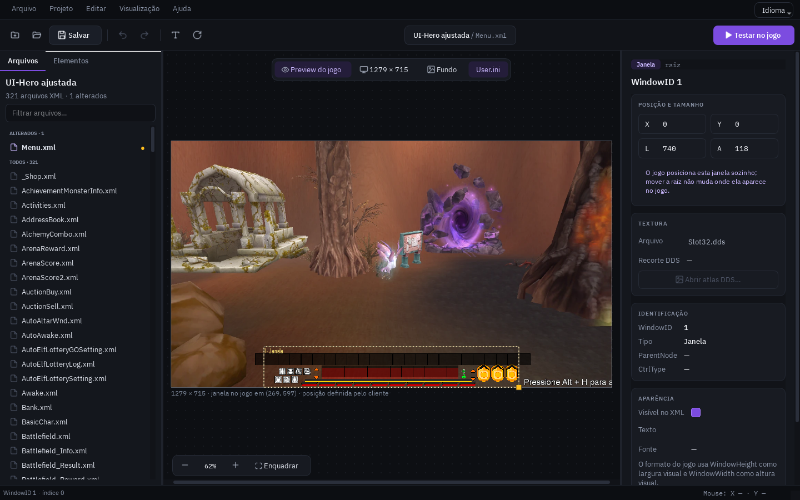
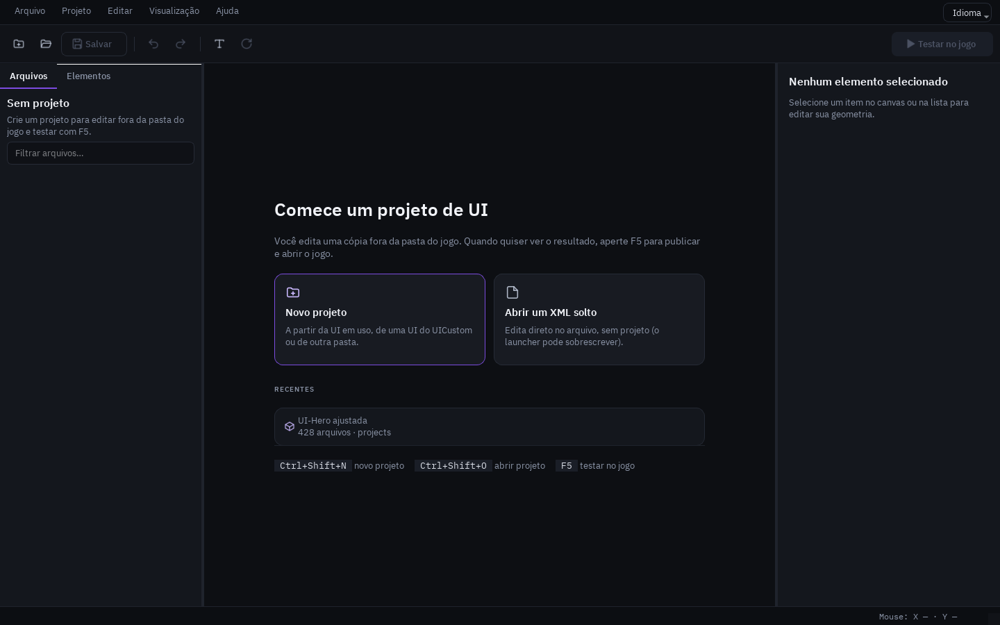
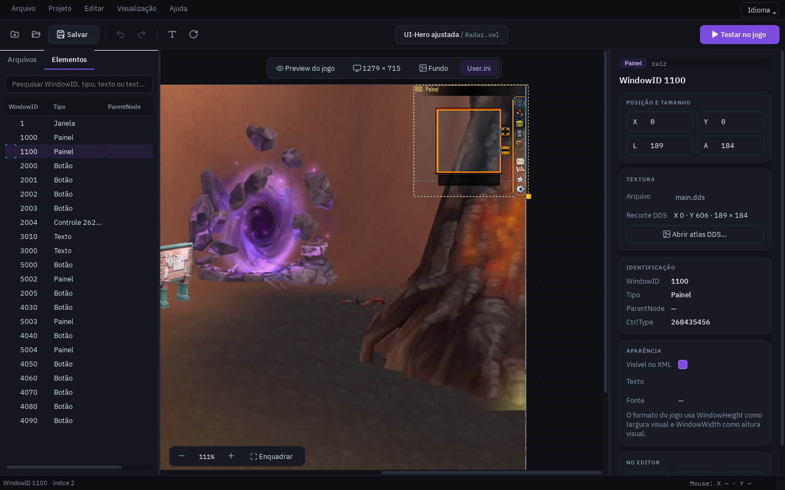
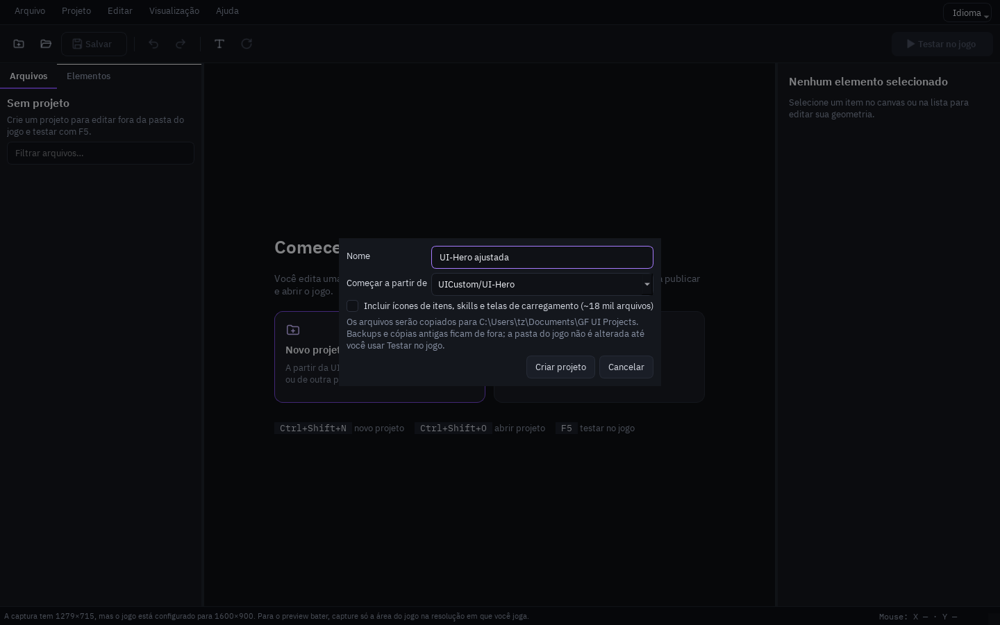
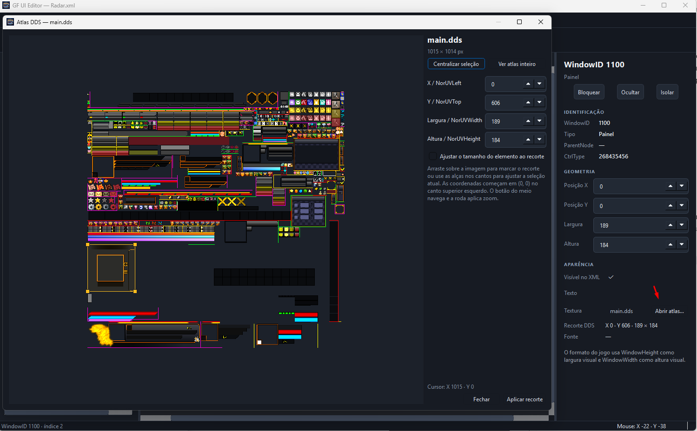

# GF UI Editor

Editor visual para os XMLs de interface do Grand Fantasia Violet.

O editor abre os XMLs em Big5, monta os elementos com as texturas DDS e permite mover e redimensionar pela tela, pela árvore ou numericamente. Ao salvar, altera somente os atributos modificados e guarda um backup exato.

Você trabalha num **projeto** fora da pasta do jogo e testa com **F5**: o editor publica a UI como UI customizada do launcher novo e a seleciona, sem precisar montar `.zip` a cada ajuste. O **preview do jogo** mostra onde cada janela aparece na resolução em que você joga, com uma captura do jogo ao fundo.

## Baixar para Windows

[](https://github.com/starzynhobr/gf-ui-editor/releases/latest/download/GF-UI-Editor-Setup.exe)

Baixe e execute o instalador. Não é necessário instalar Python. A partir da 0.2.1, o editor avisa quando há versão nova e se atualiza sozinho (**Ajuda → Verificar atualizações**): baixa o instalador, confere o SHA-256 e reabre já atualizado. O editor não inclui o jogo nem seus arquivos; abra um XML da instalação do Grand Fantasia Violet para carregar as texturas.

## Imagens do editor



| Tela inicial | Elementos e propriedades |
| --- | --- |
|  |  |
| **Novo projeto** | **Atlas de textura DDS** |
|  |  |

## Projetos e teste no jogo

O launcher novo do Grand Fantasia Violet copia a UI escolhida para a pasta `UI` do jogo a cada **Jogar**, então editar direto em `UI` perde as alterações. Por isso o editor trabalha com projetos:

1. **Arquivo → Novo projeto** (`Ctrl+Shift+N`): escolha um nome e a base — a UI em uso, uma UI de `UICustom` ou outra pasta. Os arquivos são copiados para `Documentos\GF UI Projects\<nome>\ui`, sem backups nem cópias antigas. Ícones de itens, skills e telas de carregamento (~18 mil arquivos) só entram se você marcar a opção.
2. Na aba **Arquivos**, um clique abre o XML. Os alterados aparecem no topo.
3. **Salvar** (`Ctrl+S`) guarda o backup no histórico do projeto (`.history`, últimos 20 por arquivo), sem poluir a pasta da UI.
4. **Testar no jogo** (`F5`) atualiza `UICustom\<projeto>`, copia os arquivos alterados para `UI` e seleciona o projeto no `Launcher.ini`. Outras UIs de `UICustom` não são tocadas. Depois é só abrir o jogo.
5. **Projeto → Exportar UI (.zip)** gera o pacote no formato do launcher (**Adicionar UI Customizada**) para compartilhar.

## Preview do jogo

- A moldura segue a resolução do jogo (`client.ini`) ou um tamanho escolhido na barra sobre o canvas.
- **Fundo**: use uma captura só da área do jogo, na resolução em que você joga; a moldura assume o tamanho da imagem.
- **Preview do jogo** (`P`) esconde contornos e rótulos do editor.
- Janelas que o jogo posiciona sozinho (Radar, barra de atalhos, Target, relógio…) aparecem onde o cliente as coloca; as regras foram extraídas do executável. Posições salvas no `User.ini` também são consideradas.

## Executar

Requer Python 3.11 ou superior. Na primeira execução, instale as dependências em um ambiente virtual:

```powershell
py -m venv .venv
.\.venv\Scripts\python.exe -m pip install -e .
```

No PowerShell, execute:

```powershell
.\.venv\Scripts\python.exe -m gf_ui_editor
```

Também é possível abrir um arquivo diretamente:

```powershell
.\.venv\Scripts\python.exe -m gf_ui_editor "C:\Violet Games\Grand Fantasia Violet\UI\Channel.xml"
```

O script `run.ps1` também funciona quando as dependências já estão instaladas no Python usado pelo comando `python`.

## Controles

- Clique ou árvore lateral: seleciona um elemento.
- `Ctrl` + clique: adiciona ou remove elementos da seleção; na árvore, `Shift` também seleciona intervalos.
- Arrastar qualquer item selecionado move toda a seleção como uma única ação de desfazer.
- Ao selecionar pela árvore, o elemento recebe prioridade no próximo arraste, mesmo sob outros controles; o rótulo selecionado também pode ser arrastado.
- `Alt` + clique: percorre os elementos sobrepostos naquele ponto.
- O movimento encaixa na grade de 1 pixel durante todo o arraste.
- Alça dourada no canto inferior direito: redimensiona o elemento.
- `Shift` ao mover: trava no eixo horizontal ou vertical dominante.
- `Shift` ao usar a alça dourada: preserva a proporção original do elemento.
- Botão do meio do mouse + arraste: navega pelo canvas.
- Roda do mouse: aproxima ou afasta o canvas.
- A barra inferior mostra continuamente as coordenadas X/Y do mouse no canvas.
- Setas: movem 1 pixel; `Shift` + setas movem 10 pixels.
- Pesquisa lateral: filtra por WindowID, tipo, texto, textura, ParentNode ou CtrlType.
- Bloquear/ocultar/isolar: estados temporários do editor; não alteram o XML.
- Painel direito: edita X, Y, largura e altura com atualização imediata.
- `Abrir atlas DDS`: mostra a textura inteira e marca o recorte `NorUV` do elemento.
- No atlas, arraste para escolher outro recorte ou informe X, Y, largura e altura.
- `Abrir .dds` abre a textura exibida no aplicativo padrão do Windows. Ao salvar no editor de imagem, o atlas e o canvas são atualizados automaticamente.
- `Centralizar seleção` aproxima e enquadra o recorte atual; `Ver atlas inteiro` retorna à visão geral.
- O contorno do recorte permanece com 1 pixel de tela para permitir seleção precisa em zoom alto.
- `F5`: testa o projeto no jogo.
- `Ctrl+R`: recarrega todas as texturas manualmente.
- Texturas DDS referenciadas pelo XML são recarregadas automaticamente quando outro programa as salva.
- `Ctrl+S`: salva com backup.
- `Ctrl+O`: abre um XML.
- `Ctrl+Z` / `Ctrl+Y`: desfaz/refaz.
- `Ctrl+Shift+L` / `Ctrl+Shift+H` / `Ctrl+Shift+I`: bloqueia, oculta ou isola a seleção.
- `F`: enquadra toda a interface.
- `I`: mostra ou oculta todos os identificadores. O elemento selecionado sempre mostra o próprio identificador.
- `T`: mostra ou oculta as texturas.

O menu **Ajuda → Sobre o GF UI Editor** mostra a versão instalada e oferece um botão para conhecer [outros projetos de StarzynhoBR](https://github.com/starzynhobr?tab=repositories).

## Segurança do salvamento

- Em projetos, o backup fica no histórico do projeto (`.history`). Ao editar um XML solto, fica ao lado dele, no formato `Nome.before-gf-ui-editor-AAAAmmdd-HHMMSS.xml`.
- O programa recusa salvar se outro processo tiver alterado o arquivo desde a abertura.
- Antes de salvar, uma prévia mostra o diff exato que será gravado.
- O XML é validado antes da substituição.
- O arquivo mantém Big5, quebras de linha e formatação original; somente atributos realmente editados são substituídos.

## Como o atlas DDS é referenciado

- `BGmap` escolhe o arquivo DDS.
- `NorUVLeft` e `NorUVTop` apontam o canto superior esquerdo do recorte.
- `NorUVWidth` e `NorUVHeight` definem o tamanho do recorte dentro do DDS.
- `WindowLeft` e `WindowTop` posicionam o elemento na interface.
- `WindowHeight` é a largura visual e `WindowWidth` é a altura visual no formato do jogo.

O recorte pode apontar para qualquer região válida do DDS. A primeira versão do editor de atlas altera `NorUV`; controles com estados adicionais podem usar outras estruturas UV que ainda não são editadas visualmente.

## Gerar o aplicativo para Windows

Com o ambiente virtual criado, instale as ferramentas de build e execute o script:

```powershell
.\.venv\Scripts\python.exe -m pip install -e ".[build]"
.\build.ps1
```

O executável fica em `dist\GF-UI-Editor\` e o instalador em `dist\installer\`. O script requer o Inno Setup 6 instalado. O jogo e seus arquivos não são incluídos: o editor lê as texturas DDS na pasta do XML aberto.

Ao publicar uma release, envie o instalador também com o nome `GF-UI-Editor-Setup.exe` para manter o botão de download apontando para a versão mais recente.

## Cores da interface

A paleta fica em `src/gf_ui_editor/theme.py`. O stylesheet e os desenhos do canvas/atlas usam os mesmos tokens; altere os valores ali para ajustar as cores sem procurar por literais espalhados pelo código.

As decisões de hierarquia visual e os critérios para avaliar novas mudanças estão em [`docs/ui-review.md`](docs/ui-review.md).

O editor inclui português, inglês, espanhol e francês. Escolha pelo botão **Idioma** no canto superior direito; a troca é imediata e mantém o projeto e o XML abertos. O fluxo para manter as traduções está em [`docs/internationalizacao.md`](docs/internationalizacao.md).
